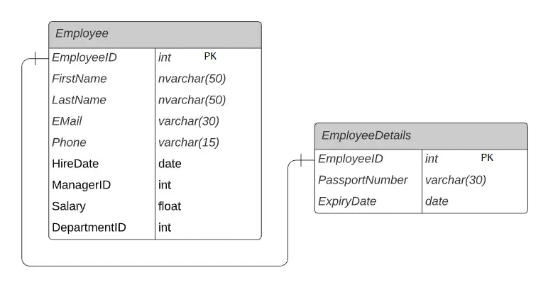
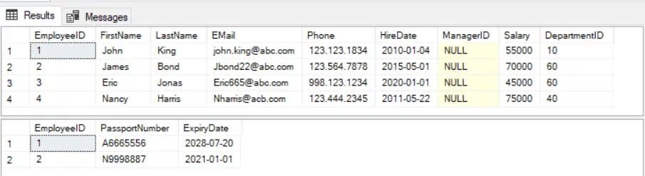
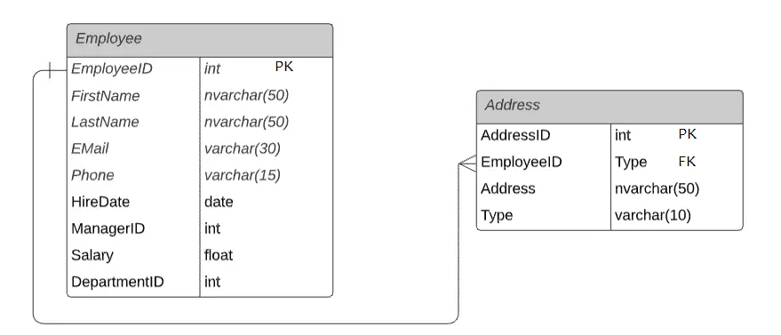
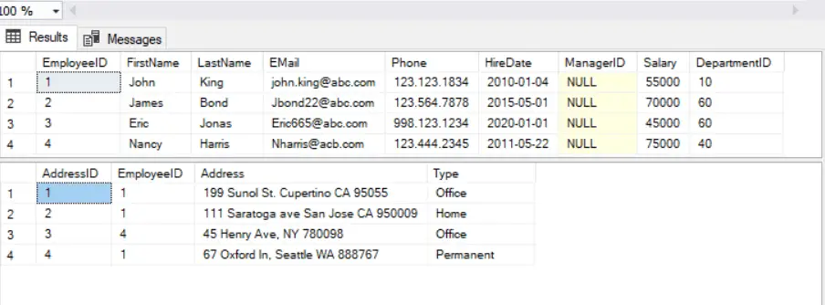

# 1. What is RDBMS?

- RDBMS stands for Relational Database Management System.
- RDBMS is the basis for all modern database systems.
---
## RDBMS Example systems :-
1. PostgreSQL
1. MySQL
1. Microsoft SQL Server
1. Oracle
1. Microsoft Access

---
# 2. RDBMS vs. DBMS :-

**DBMS** or **Database Management System** is software used to identify, manage, and create a database that provides administered access to the data. In **DBMS**, the data is stored as a file, whereas in **RDBMS**, data is stored in the form of tables. [RDBMS vs. DBMS.](https://byjus.com/gate/difference-between-dbms-and-rdbms/#:~:text=DBMS%20stands%20for%20Database%20Management,in%20the%20form%20of%20tables.)

---
# 3. What Is PostgreSQL?
- It's the most advanced open-source relational database out there.
- It's an object-relational database management system **(ORDMBS)**, which means that it has relational capabilities and an object-oriented design. [PostgreSQL.](https://www.postgresql.org/)
---
## What Does Object-Relational Database Mean?
An object-relational database **(ORD)** is a database management system **(DBMS)** that’s composed of both a relational database **(RDBMS)** and an object-oriented database **(OODBMS)**. 
[to know more about object-Relational Database.](https://www.techopedia.com/definition/8714/object-relational-database-ord)

---
# 4. PostgreSQL Clients :-
Postgres can be connected from a programming language, a CLI tool or a GUI. Postgres follows the Client Server architecture where the server listens to requests from the client and returns a response.

---
## Some of the popular client applications for PostgreSQ :-

- **pg_dump** - Extracting database into a file.
- **pg_restore** - Restoring a database from a file.
- **create_db** - Create a new PostgreSQL database.
- **create_user** - Create a new PostgreSQL user account.
- **psql** - Interactive terminal.
[PostgreSQL clients.](https://www.postgresql.org/docs/current/reference-client.html)

---
# 5. What purpose does pgAdmin serve in PostgreSQL?
 - pgAdmin is the leading open source management tool for PostgreSQL.
 - It provides a powerful graphical interface that simplifies the creation, maintenance, and use of database objects.
 [more about pgAdmin.](https://www.enterprisedb.com/postgres-tutorials/pgadmin-comparable-tool-plsql-developer-postgresql#:~:text=pgAdmin%20is%20the%20leading%20open,and%20use%20of%20database%20objects.)

 ---
 # 6. Naming conventions :-
 for example, when we name **RDBMS** we should always remember that consistency is the best approach.

 ## some of the most importants rules :-
1. Use lowercase names. e.g. user, username
1. If the name of the table or column must consist of more than one word, use an underscore(_) to connect them(i.e. snake_case). e.g. user_account
1. Use UPPERCASE for SQL keywords (e.g. SELECT, INSERT) and built-in functions (e.g. LOWER(), COUNT()).
1. Avoid use of dots, spaces, or dashes in database, schema, table, or column names.
1. When naming objects, balance the objective of keeping names short and easy to use with the objective of making names as descriptive as possible. When in doubt, choose the more descriptive name, because the objects in the database may be used by many people over a period of time. For example use payment_due_date instead of pmdd.
[for more info about naming conventions.](https://www.coding-guidelines.lftechnology.com/docs/rdbms/rdbms-naming-convention/)

----
# 7. Constraints in PostgreSQL:-
- **Constraints** are a way to tell Postgres which kinds of data can be inserted into tables, columns, or rows.
- **Constraints** give you as much control over the data in your tables as you wish. If a user attempts to store data in a column that would violate a constraint, an error is raised. This applies even if the value came from the default value definition.
[To know more about constraints and their types.](https://www.postgresql.org/docs/current/ddl-constraints.html)
---
# 8. Indexing in PostgreSQL:-
- **Indexing** is a data structure -B+Tree mostly- that you build and assign on top of an existing table that looks through your table, tries to anaylize it and summarize it so it can create kind of a shortcut. Basically, **Indexing** are a common way to enhance database performance.

 For example, if you want to reference all pages in a book that discusses a certain topic, you have to first refer to the **index**, which lists all topics alphabetically and then refer to one or more specific page numbers.
 [Indexing in PostgreSQL.](https://www.tutorialspoint.com/postgresql/postgresql_indexes.htm)
 
 ---
# 9. How does indexing in MySQL differ from PostgreSQL?
**MySQL** supports B-tree and R-tree indexing that stores hierarchically indexed data.**PostgreSQL** index types include trees, expression indexes, partial indexes, and hash indexes. [MySQL vs. PostgreSQL.](https://medium.com/@hnasr/postgres-vs-mysql-5fa3c588a94e)

---
# 10. Relations :-
 In a relational database, each table is connected to another table using the Primary-Foreign Key constraints.
## 1- One-to-One Relation :-
  In **One-to-One relationship**, one record of the first table will be linked to zero or one record of another table. For example, each employee in the `Employee` table will have a corresponding row in `EmployeeDetails` table that stores the current passport details for that particular employee. So, each employee will have zero or one record in the `EmployeeDetails` table. This is called zero or one-to-one relationship.
  

Above, `EmployeeID` column is the primary key as well as foreign key column in the `EmployeeDetails` table that linked to `EmployeeID` of the `Employee` table. This forms zero or one-to-one relation.

 ### The following query will display data from both the tables :-
 ```SQL
 SELECT * FROM Employee
 SELECT * FROM EmployeeDetails
 ```

The following is the result of the above queries that demonstrate how each employee has none or just one corresponding record in `EmployeeDetails` table.


---
## 2- One-to-Many Relation :-
**One-to-Many** is the most commonly used relationship among tables. A single record from one table can be linked to zero or more rows in another table.

Let's take an example of the `Employee` and `Address` table in the `HR` database. The `Employee` table stores employee records where `EmployeeID` is the primary key. The `Address` table holds the addresses of employees where `AddressID` is a primary key and `EmployeeID` is a foreign key. Each employee will have one record in the `Employee` table. Each employee can have many addresses such as Home address, Office Address, Permanent address, etc.

The `Employee` and `Address` tables are linked by the key column `EmployeeID`. It is a foreign key in the `Address` table linking to the primary key `EmployeeID` in the `Employee` table. Thus, one record of the `Employee` table can point to multiple records in the `Address` table. This is a One-to-Many relationship.


### The following query will display data from both the tables :-
```SQL
SELECT * FROM Employee
SELECT * FROM Address
```
The following is the result of the above queries to demonstrate how the data is related in **one-to-many relationship**.
In the above data, each record in the `Employee` table associated with zero or more records in the `Address` table, e.g. `James Bond` has zero address, `John King` has three addresses. [Relations.](https://www.tutorialsteacher.com/sqlserver/tables-relations#one-to-one-relation)

----
# 11. Multi-version concurrency Control :-
One of the big selling points of Postgres is how it handles concurrency. The promise is simple: reads never block writes and vice versa. Postgres achieves this via a mechanism called Multi Version Concurrency Control. This technique isn’t unique to Postgres: there are several databases that implement some form of MVCC including Oracle, Berkeley DB, CouchDB and many more. Understanding how MVCC is implemented in Postgres is important when designing highly concurrent apps on PostgreSQL. It’s actually an elegant and simple solution to a hard problem.
[MVCC.](https://devcenter.heroku.com/articles/postgresql-concurrency#how-mvcc-works)

----
# 12. Triggers :-
 An SQL trigger allows you to specify SQL actions that should be executed automatically when a specific event occurs in the database.

 ## Types of SQL Triggers :-

### 1. Row-Level Triggers :-
A **row-level trigger** is executed once for each row affected by the triggering event, which is typically an `INSERT`, `UPDATE`, or `DELETE` statement.

For example, let’s assume you defined an `INSERT` trigger for a table. Then, you add several rows to that table with a single query. So, the row trigger will be automatically fired for each new row.

**Row-level triggers** are particularly useful to enforce business rules, maintain database integrity, and automatically perform SQL tasks. At the same time, they can have a significant impact on the performance of a database. This is especially true if they are used extensively or contain complex queries. So, you need to use row-level triggers only when really necessary.

### 2. Statement-Level Triggers :-
A **statement-level trigger** is executed once for the entire triggering event, instead of once for each row affected by the event. Statement-level triggers are useful to perform an action based on the overall effect of an `INSERT`, `UPDATE`, or `DELETE` statement, rather than on individual rows.
[more about triggers in SQL.](https://www.dbvis.com/thetable/sql-triggers-what-they-are-and-how-to-use-them/#:~:text=An%20SQL%20trigger%20allows%20you,is%20inserted%20into%20another%20table.)

----
# 13. How can you take the backup of a database?

As with everything that contains valuable data, PostgreSQL databases should be backed up regularly. While the procedure is essentially simple, it is important to have a basic understanding of the underlying techniques and assumptions.

There are three fundamentally different approaches to backing up PostgreSQL data:

- SQL dump
- File system level backup
- On-line backup

Each has its own strengths and weaknesses. let's discuss one of them which the **SQL dump**.

The idea behind the **SQL-dump** method is to generate a text file with SQL commands that, when fed back to the server, will recreate the database in the same state as it was at the time of the dump. PostgreSQL provides the utility program pg_dump for this purpose. The basic usage of this command is:
```SQL
pg_dump dbname > outfile
```
As you see, pg_dump writes its results to the standard output. We will see below how this can be useful.

pg_dump is a regular PostgreSQL client application (albeit a particularly clever one). This means that you can do this backup procedure from any remote host that has access to the database. But remember that pg_dump does not operate with special permissions. In particular, it must have read access to all tables that you want to back up, so in practice you almost always have to run it as a database superuser.

To specify which database server pg_dump should contact, use the command line options -h *host* and -p *port*. The default host is the local host or whatever your PGHOST environment variable specifies. Similarly, the default port is indicated by the PGPORT environment variable or, failing that, by the compiled-in default. (Conveniently, the server will normally have the same compiled-in default.)

As any other PostgreSQL client application, pg_dump will by default connect with the database user name that is equal to the current operating system user name. To override this, either specify the -U option or set the environment variable PGUSER. Remember that pg_dump connections are subject to the normal client authentication mechanisms (which are described in Chapter 20).

Dumps created by pg_dump are internally consistent, that is, updates to the database while pg_dump is running will not be in the dump. pg_dump does not block other operations on the database while it is working. (Exceptions are those operations that need to operate with an exclusive lock, such as VACUUM FULL.)

Important: When your database schema relies on OIDs (for instance as foreign keys) you must instruct pg_dump to dump the OIDs as well. To do this, use the -o command line option.
[Database backup.](https://www.postgresql.org/docs/8.1/backup.html)
